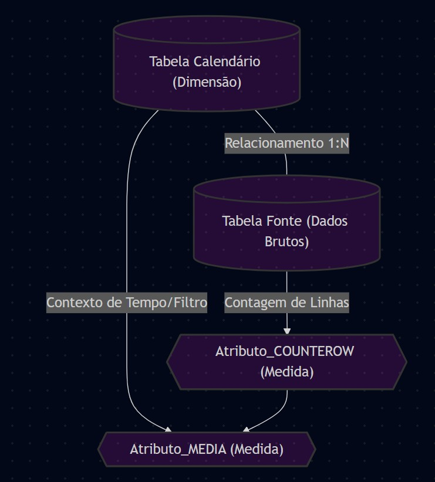

# pbi-painel-consolidado  

Relatório de Atividades dos Processos SEI - Análise Consolidada  

**1. Diagrama dos objetos envolvidos nesse painel**  
     
     

**2. DAX para contar a ocorrência de um atributo ou operações relacionados com aquele atributo (Ex: "Concluído")**  
   
   Operações de Conclusão_COUNTROWS =  
COUNTROWS (  
    FILTER (  
        'fonte-de-dados',  
        'fonte-de-dados'[Coluna do Atributo] = "Atributo que será contabilizado"  
    )  
)  
**3. DAX para contar a ocorrência de processos com esse atributo (Ex: "Concluído")**  
   
Processos Concluídos_DISTINCTCOUNT =  
CALCULATE (  
    DISTINCTCOUNT ( 'fonte-de-dados'[Coluna do número do Processo] ), 
    'fontes (2)'[Coluna do Atributo] = "Concluído"  
)  

_Comentário 1: a coluna "número do Processo" deve ser um atributo de identidade como uma chave PK._  
_Comentário 2: geralmente o valor de Operações > Processos que sofreram a operação._  

**4. DAX para calcular a média (Ex: Média mensal dos processos que sofreram a operação identificada na coluna "Atributo")**  
   
Concluídos_MEDIA =  
AVERAGEX (  
    VALUES ( Calendario_2025[Mes] ), 
    CALCULATE ( 
        [Processos Concluídos_DISTINCTCOUNT], 
        Calendario_2025[Ano] = 2025  
    )
)
